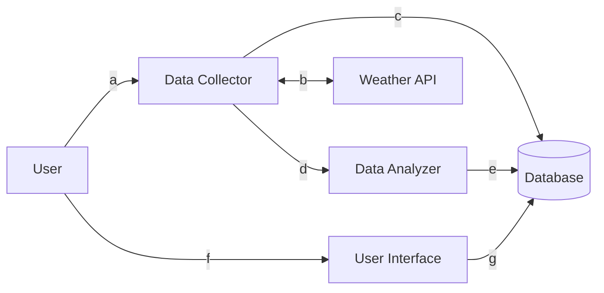

# Weather Wars Application

This application was built in response to regular conversations I have with various family members regarding the weather. Specifically, they don't agree with me when I tell them that it is SO cloudy where they live and SO much sunnier where I live (I'll let you guess who lives where based on the DATA 😜)

(Was it spiteful to build an entire application just to prove a point?

... No comment.)

## Testing the Live Application

You can view this application live [here](https://watch-party-96bl.onrender.com)

(I'm aware that its not even remotely close to being even remotely cute. It's an MVP!! [Here's an eyeball palette cleanser](https://kaileywaal.com/) if you need it.)

## What it does

The app collects data from several locations and stores this data in a SQLite database. Currently the location options are limited to locations where said family members live, though a future, less self-indulgent iteration could expand the locations available so it could actually be useful to other people 😉.

It performs analysis on the weather data retrieved to answer a simple question: out of all possible hours that it _could_ be sunny (AKA when it is not night time), what percentage of the time is it ACTUALLY sunny?

On the web app, users can select two locations to compare. They will see historical data for both, with the "winner" for that particular day highlighted in green. (Hence "Weather **Wars**." This is serious stuff, people!!).

## Application Features

This application was built for CSCA-5028 (Applications of Software Architecture for Big Data). The following is an explanation of the project's features, outlined according to the project rubric.

### Web application basic form, reporting

- Built in Flask.
- Source code can be found in applications/web/app.py

### Data collection

- Data collection application collects historical weather data from [Open-Meteo API](https://open-meteo.com/en/docs/historical-weather-api/#start_date=2024-01-01&end_date=2024-04-08&hourly=&daily=daylight_duration,sunshine_duration&temperature_unit=fahrenheit&wind_speed_unit=mph&precipitation_unit=inch) and stores it in SQLite database.
- Source code can be found in applications/data_collector.py

### Data analyzer

- Data analyzer is triggered after new data is collected. It grabs any unanalyzed data and performs calculations to determine what percent of daylight hours were sunny for a given area. It stores this calculation in a SQLite database to allow quick + easy usage by the web application.
- Source code can be found in applications/data_analyzer.py

### Unit tests

- Unit tests written to ensure data analyzer and data collection work as expected.
- Tests are configured to run automatically on push for CI/CD through Github Actions. They can also be run manually via run_tests.py python script.
- All tests can be found in applications/tests folder.

### Data persistence any data store

- SQLite database for data persistence. Chosen because it is lightweight and this is a small-scale application that does not have need for additional complexity with hosting a separate database instance.
- SQLAlchemy as ORM to allow for database abstraction. Hypothetically, if there ever were a need to scale this application it would be easier to migrate.
- Database initialization code found in schema_setup.py. Interactions with data through DataGateway classes, found in components folder.

### Rest collaboration internal or API endpoint

- Data collection application collects historical weather data from [Open-Meteo API](https://open-meteo.com/en/docs/historical-weather-api/#start_date=2024-01-01&end_date=2024-04-08&hourly=&daily=daylight_duration,sunshine_duration&temperature_unit=fahrenheit&wind_speed_unit=mph&precipitation_unit=inch)

### Product environment

- Application is hosted on [Render](https://render.com)
- Can view live [here](https://watch-party-96bl.onrender.com)

### Integration tests

- Integration tests ensure data analyzer and data collection work together as expected.
- Tests are configured to run automatically on push for CI/CD through Github Actions. They can also be run manually via run_tests.py python script.
- All tests can be found in applications/tests folder.

### Using mock objects or any test doubles

- Mock objects and test doubles are utilized to emulate the behavior of external dependencies or components that the application interacts with.
- Can be found in tests, which are in the applications/tests folder

### Continuous integration

- Continuous integration using GitHub Actions
- Configured to run all tests on push.
- You can view previous actions that have been triggered [here](https://github.com/kaileywaal/weather-wars/actions)
- Configuration details can be found in .github/workflows/cicd.yml (continuous integration is the "test" step)

### Production monitoring instrumenting

- `/health` endpoint returns 200 OK response when application is healthy.
- Source found in applications/web/app.py

### Event collaboration messaging

Not yet implemented (TODO: ??)

### Continuous delivery

- Continuous delivery using GitHub Actions
- Configured to trigger deployment to Render using a secret deploy hook assuming all CI tests pass.
- Configuration details can be found in .github/workflows/cicd.yml (continuous delivery is the "deploy" step)

## Architecture + Design

### High-Level Application Architecture

#### Explanation of Interactions

(a) User calls "/trigger-data-collector" API endpoint\* to (b) trigger the data collector to collect weather data from the Weather API and (c) add it to the database. Once collection is complete, (d) the Data Collector lets the Data Analzer know that there is new data to analyze and (e) the Data Analyzer performs calculations and adds analyzed data to the database. (f) The user is then able to view the analyzed data in the user interface, which is (g) displaying data that is stored in the database.

\*_Could easily turn this trigger into cron job, but I didn't want to pay for that 😛_

### Justification for Design Decisions

1. SQLite database - in a real-world, high traffic application, I would have chosen a more robust database, but since this application will likely only be useful for me to prove a point I saw no need to add complexity here since SQLite can be hosted alongside my app.
2. SQLAlchemy - with the above decision, if I did wish to expand this app beyond an MVP (you know, by adding other, less me-centric locations), I used SQLAlchemy to allow for easier database migrations since it decouples the database logic from the database itself.
3. Flask - I chose Flask because it is a simple UI that does not require any dynamic interactions (in which case I would have used a JavaScript library). Since it is simply reporting on data that has already been collected and analyzed, a simple UI with Flask made the most sense - especially for speed!
